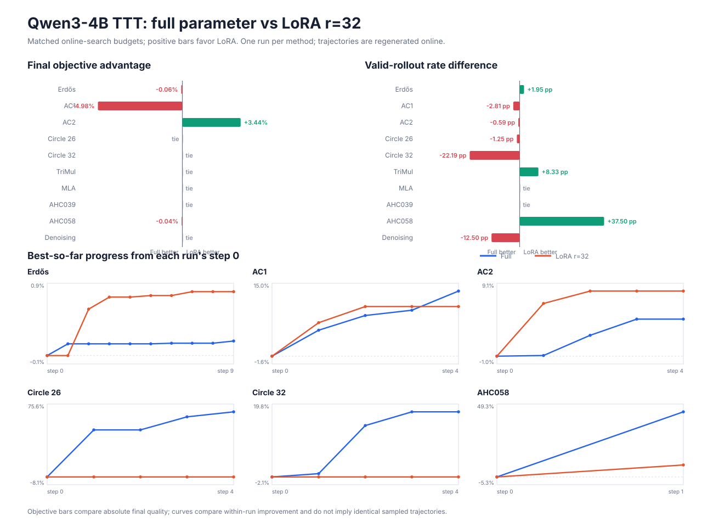

# Qwen3-4B TTT-Discover: LoRA vs full-parameter A/B

Snapshot: 2026-08-18. Model: Qwen3-4B. Hardware: 8×A100 80GB.

## Cross-domain snapshot

The objective column compares absolute final quality in each task's native
direction; positive deltas favor LoRA. Valid counts measure verifier success,
not whether a candidate beat the incumbent.

| Task | Budget / method | Full final | LoRA r=32 final | LoRA objective delta | Full valid | LoRA valid |
|---|---:|---:|---:|---:|---:|---:|
| Erdős ↓ | 1,280 | **0.381659** | 0.381900 | -0.063% | 400 | **425** |
| AC1 ↓ | 640 | **1.691701** | 1.775990 | -4.983% | **575** | 557 |
| AC2 ↑ | 640 target | 0.796296 | **0.823691** | +3.440% | 590/640 | 469/512* |
| Circle 26 ↑ | 640 | **2.438966267382** | 2.438966267380 | tie | **143** | 135 |
| Circle 32 ↑ | 640 | 2.666667 | 2.666667 | tie | **258** | 116 |
| TriMul A100 ↓ | 24 | 903.62 μs | 903.62 μs | tie | 8 | **10** |
| MLA Decode A100 ↓ | 8 | 539.462 μs | 539.462 μs | tie | 8 | 8 |
| AHC039 ↑ | 8 | 3,755.4 seed | 3,755.4 seed | no valid child | 0 | 0 |
| AHC058 ↑ | 8 | **2,922,660.2** | 2,921,429.2 | -0.042% | 5 | **8** |
| Denoising ↓ | 8 | 0.2314119 seed | 0.2314119 seed | no improvement | **7** | 6 |

\* AC2 LoRA has one unreadable rollout artifact, so its candidate-level count
covers 512 readable samples. Its archive-derived five-step final objective is
intact.

Across the completed objective comparisons, full parameter wins Erdős, AC1,
and AHC058; LoRA wins AC2; Circle 26, Circle 32, and both GPU kernels tie at the
final frontier. AHC039 and denoising do not produce an objective improvement
under these small budgets. The per-domain details below show why final extrema
alone are insufficient: LoRA often changes feasibility without changing the
best score. On Circle 32, LoRA reaches the tied frontier in step 0 but produces
116/640 valid candidates versus full parameter's 258/640.

## CUDA Graph diagnosis

There were two separate eager fallbacks:

1. historical LoRA wrappers explicitly exported
   `TTT_SGLANG_DISABLE_CUDA_GRAPH=1`;
2. after removing that workaround, the base launcher still captured only
   through batch size 16. The 8×16 campaign averages 32 live requests per
   TP=2 engine, and two-phase asynchronous routing was observed to peak at 40.

The first issue was removed from every LoRA launcher. The base launcher now
captures through batch size 64 by default, with
`TTT_SGLANG_CUDA_GRAPH_MAX_BS` retained as a memory-sensitive override. Logs
from the online Circle 32 run show `cuda graph: True` whenever the live batch
falls to 16 or below after a LoRA weight update, proving that online weight
synchronization itself does not invalidate the captured graph. Batches above
16 in that already-started run still use eager because its server was launched
with the old limit; its wall time is therefore not used for a method-speed
claim. A separate short 128-request probe with the new capture set then logged
`#running-req: 29, cuda graph: True` after online LoRA weight synchronization;
the probe was stopped before training/checkpointing.

## Erdős matched-scale protocol

### Setting

Both runs used the same model, task prompt, verifier, PUCT implementation,
two-phase generation, and online-search budget:

- Qwen3-4B on 8×A100 80GB;
- 10 TTT updates;
- 8 parent groups × 16 candidates = 128 online rollouts per update;
- 1,280 rollouts total;
- 8,192-token response limit and 4,096-token phase-1 boundary;
- adaptive-entropic advantages and token-level KL shaping.

The adaptation hyperparameters were method appropriate:

- full parameter: Adam, learning rate `1e-6`;
- LoRA: rank 32, alpha 32, dropout 0, QKV/attention-output/MLP projections,
  Adam, learning rate `4e-5`.

The experiment deliberately regenerated trajectories online. Reusing the old
full-parameter trajectories would test an offline update but would not measure
the central TTT effect whereby an updated model changes later exploration.

## Erdős results

| Metric | Full parameter | LoRA r=32 | Difference |
|---|---:|---:|---:|
| Final best objective ↓ | **0.38165901** | 0.38190008 | full better by 0.00024107 |
| Gap to reported 0.380876 ↓ | **0.00078301** | 0.00102408 | full smaller |
| Valid rollouts | 400 / 1,280 | **425 / 1,280** | LoRA +25 |
| Valid rate | 31.25% | **33.20%** | LoRA +1.95 points |
| Final archive size | 137 | **139** | LoRA +2 |
| Valid-score median ↓ | **0.383389** | 0.391874 | full much better |
| Valid-score best 10% cutoff ↓ | **0.382032** | 0.382202 | full better |
| Truncated rollouts | 1 | 1 | tied |
| Mean response length | 4,306.7 | 4,247.0 | similar |

### Best-so-far curve

| Step | Full parameter | LoRA r=32 |
|---:|---:|---:|
| 0 | **0.382321** | 0.384827 |
| 1 | **0.381785** | 0.384827 |
| 2 | **0.381785** | 0.382700 |
| 3 | **0.381785** | 0.382148 |
| 4 | **0.381785** | 0.382148 |
| 5 | **0.381785** | 0.382078 |
| 6 | **0.381760** | 0.382078 |
| 7 | **0.381760** | 0.381900 |
| 8 | **0.381760** | 0.381900 |
| 9 | **0.381659** | 0.381900 |

### Valid rollouts per step

| Step | Full parameter | LoRA r=32 |
|---:|---:|---:|
| 0 | 28 | 25 |
| 1 | 35 | 45 |
| 2 | 50 | 49 |
| 3 | 44 | 47 |
| 4 | 28 | 33 |
| 5 | 38 | 54 |
| 6 | 44 | 44 |
| 7 | 26 | 59 |
| 8 | 52 | 31 |
| 9 | 55 | 38 |

## Interpretation

In this single matched-budget run, rank-32 LoRA learned feasibility more
readily: it produced more valid programs and a slightly larger archive. Full
parameter training produced a substantially better distribution among valid
solutions and a better final extreme value. This supports the task-level
interpretation that low-rank adaptation efficiently shifts broad generation
behavior, while the additional degrees of freedom in full-parameter training
can help concentrate probability on fine numerical improvements.

The difference is small at the best-solution level: LoRA is 0.000241 above the
full-parameter result, about 0.063% of the full result. It is nevertheless
consistent across the best-so-far curve and the valid-score quantiles.

This is one online run per method, not a multi-seed statistical result. Initial
sampling trajectories differ. The historical LoRA run disabled SGLang CUDA
graphs as a workaround for an intermittent startup hang; current launchers no
longer apply that workaround because it made wall-clock comparisons asymmetric.
A stronger causal claim still requires multiple paired seeds and a
learning-rate/rank sweep.

## Evidence

- Machine-readable cross-domain summary: `docs/ttt_lora_vs_full_results.json`
- Saved presentation figure: `docs/assets/ttt-lora-vs-full.svg`
- Figure generator: `local/plot_lora_vs_full.py`
- Circle 32 LoRA: `checkpoints/qwen3-4b-ttt-circle32-lora-r32-8x16x5/`
- Full run: `checkpoints/qwen3-4b-ttt-erdos-8x16x10/`
- LoRA run: `checkpoints/qwen3-4b-ttt-erdos-lora-r32-8x16x10/`
- LoRA smoke: `checkpoints/qwen3-4b-ttt-erdos-lora-r32-smoke-v4/`
- Launchers: `local/run_ttt_erdos_lora_smoke.sh` and
  `local/run_ttt_erdos_lora_scale.sh`
